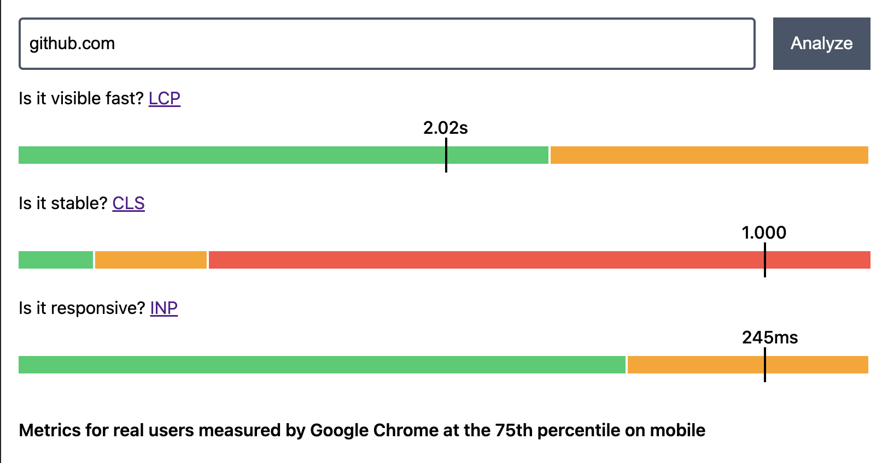

# Website Analyzer Web Component

<p>
  <a href="https://www.webcomponents.org/element/website-analyzer-wc" targe="_blank">
    
  </a>
  <a href="https://bundlephobia.com/package/website-analyzer-wc" targe="_blank">
    
  </a>
</p>

It's a no framework, no dependency built component that weighs a litte over 3kb <3

## Installation and Usage

### Installation as a npm package

Use one of your favorite package manager:

```bash
npm install website-analyzer-wc
```

```bash
pnpm install website-analyzer-wc
```

```bash
yarn install website-analyzer-wc
```

### Usage as a npm package

In the file where you want to use it, import the package:

```javascript
import "website-analyzer-wc";
```

and anywhere in your html / jsx use the tag `<website-analyzer />`

### Installation as a direct script

Copy the content of [main-script.html](./packages/website-analyzer-wc/dist-script/script.html) inside your HTML code, for example inside your <head> tag

### Usage as a direct script

Use the tag `<website-analyzer />` anywhere you want in your HTML code

## Examples

### UI

The UI looks like this: 

### Code

Usage of exampe is in [./packages/website-analyzer-demo](./packages/website-analyzer-demo)

## Develop

Project is using pnpm with [Corepack](https://pnpm.io/installation#using-corepack) in a workspace setup

```shell
pnpm install
```

The package `website-analyzer-wc` contains the web component source code and the package `website-analyzer-demo` contains a simple demo setup.

You can uncomment `link-workspace-packages=true` in the .nmprc to link them locally to develop

## Contribute

1. Fork it!
2. Create your feature branch: `git checkout -b my-new-feature`
3. Commit your changes: `git commit -am 'Add some feature'`
4. Push to the branch: `git push origin my-new-feature`
5. Submit a pull request :D

## Credits

Thanks to [lbineau](https://github.com/lbineau) for inspiring me to gte started with web components

## License: MIT
